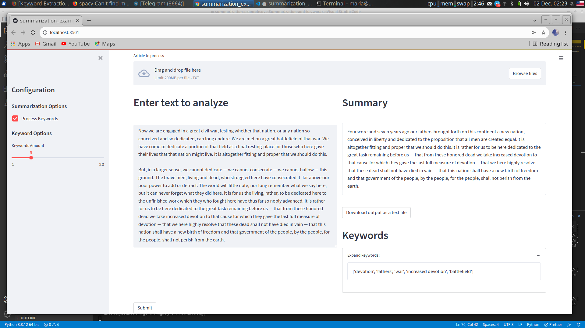

# Streamlit Summary

Making extractive summary + keyword recognition with BERT and WordWise.

*Links to the model-containing repos:*

- [WordWise;](https://github.com/jaketae/wordwise)
- [BERTSummarizer;](https://github.com/dmmiller612/bert-extractive-summarizer)
- [KeyBERT;](https://github.com/MaartenGr/KeyBERT)

## Run w/o Docker

```bash
streamlit run summarization_example.py 
```

## Run w Docker

```bash
docker build -t imstupidassbastard .
docker run -p 8501:8501 imstupidassbastard:latest
```
## Demo image

