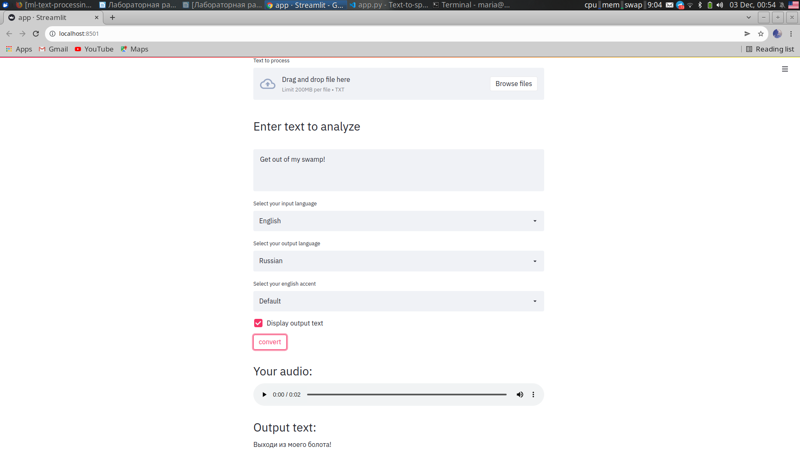

# Streamlit TTS + MT

MT + TTS app using GoogleTrans.

## Run w/o Docker

```bash
streamlit run app.py 
```

## Run w Docker

```bash
docker build -t imstupidassbastard .
docker run -p 8501:8501 imstupidassbastard:latest
```
## Demo image


