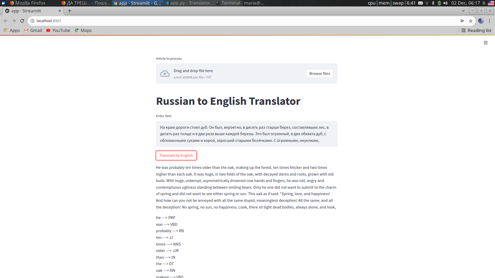

# Streamlit NMT + POS

*!!is not fully done yet!!*

NMT using large BART model + POS tagging using NLTK.

Download pre-treined model locally to accelerate processing.
```bash
git lfs install
git clone https://huggingface.co/facebook/mbart-large-50-many-to-many-mmt
```

*Links to the useful info:*

- [NLTK;](https://www.nltk.org/)
- [mBART;](https://huggingface.co/facebook/mbart-large-50-many-to-many-mmt)
- [also check for mBART;](https://huggingface.co/facebook/mbart-large-50)

## Run w/o Docker

```bash
streamlit run app.py 
```

## Run w Docker

```bash
docker build -t imstupidassbastard .
docker run -p 8501:8501 imstupidassbastard:latest
```
## Demo image



## Report

- [report link](https://docs.google.com/document/d/1eF1A9zUhS8MBVdTLceIxxdlhi6RwqjE1Bg2sIMTDxLI/edit#)
